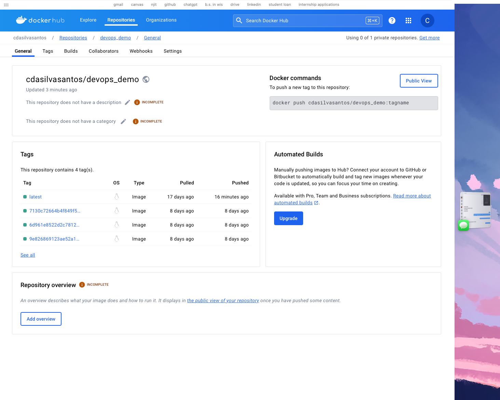

# Event Manager - Homework 10 Assignment - IS 219

### Documentation
During the "Event Manager" assignment, I encountered various challenges and opportunities for growth. One major hurdle was troubleshooting and debugging issues within the codebase. It often felt like navigating through a maze, but with each problem resolved, my understanding deepened, and subsequent tasks became more manageable. Collaboratively, managing different branches and coordinating work posed its own challenges, necessitating clear communication and meticulous organization. Leveraging Git for version control and GitHub for issue tracking and code reviews proved invaluable, providing structure and aiding in task management. This experience underscored the importance of discipline and resource utilization in solo projects, akin to having a virtual assistant guiding me through the development process.

Reflecting on the assignment, I'm amazed at the extent of my growth and the breadth of new skills and technologies I've acquired. From delving into the intricacies of REST API functionality to mastering Git and GitHub for version control and collaboration, each aspect of the assignment introduced me to something novel. Hands-on experience with Docker for containerization and pytest for automated testing expanded my technical repertoire, while debugging and implementing solutions honed my problem-solving prowess. Overall, this assignment transcended mere task completion; it was a journey of continuous learning and self-improvement, affirming my progress and instilling confidence in my abilities as a software QA analyst/developer.

### Issues
- [Issue 1: Incorrect User Bio](https://github.com/cdasilvasantos/homework10/issues/1)
- [Issue 2: Incorrect Profile Picture URL](https://github.com/cdasilvasantos/homework10/issues/3)
- [Issue 3: HTTP Code](https://github.com/cdasilvasantos/homework10/issues/5)
- [Issue 4: RefreshTokenRequest Missing Token](https://github.com/cdasilvasantos/homework10/issues/8)
- [Issue 5: Incorrect HTTP Code](https://github.com/cdasilvasantos/homework10/issues/10)
- [Issue 6: Test Coverage](https://github.com/cdasilvasantos/homework10/issues/12)

### Github Actions

### DockerHub Image
